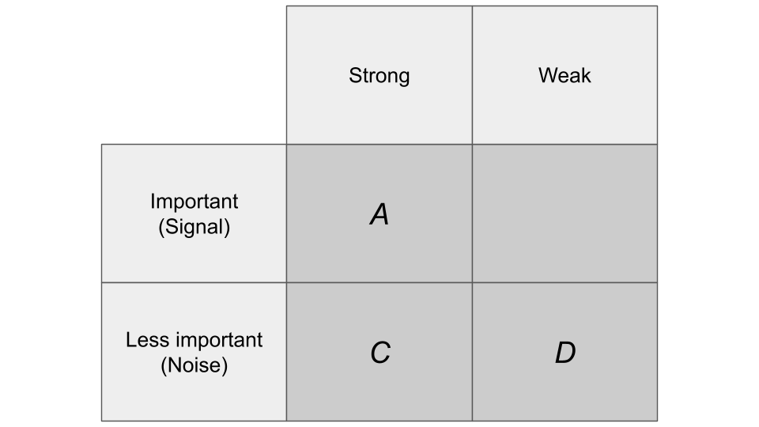

Consider the image below. Left alone, humans tend to process information in the order C→D→A. They react to noise before signals, and even within noise, they are drawn to strong noise first. They reluctantly process strong noise (C), weak noise (D), and strong signal (A), but then ignore weak signal (B). This tendency is even more pronounced when watching YouTube videos than when working.

When working, an unskilled worker who's good at the job processes tasks in the order A to B. However, as they become more skilled, their order gradually shifts to B to A. They prioritize importance over signal strength. They understand that the more important something is, the less visible it tends to be. They prioritize important information found in weak signals (B) and process strong signals (A) later. They avoid processing C and D whenever possible.

People with excellent work abilities tend to gradually lean towards doing B and avoid doing A as much as possible.

At some point, you see what's most important in the absence of signals and focus on doing only that. The rest was either unnecessary in the first place, naturally eliminated because you've done X, or prioritized later based on X. You only do the most important X, the least visible, and the rest is left alone.

When it comes to prioritizing tasks, the ability to identify X is more effective than the ability to measure the order of A, B, C, D, .... This is because if X works, A, B, C, D, ... will become unnecessary in the first place.

